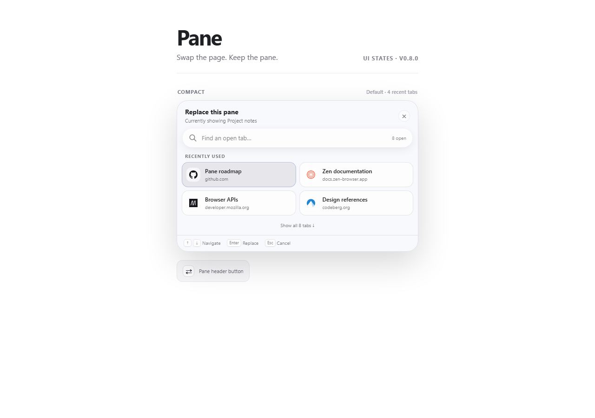

# Pane for Zen Browser

[](LICENSE)
[](https://github.com/001vamp/zen-pane-manager/actions/workflows/validate.yml)

Split, float, arrange, and replace open tabs in Zen Browser. Pane keeps your existing tabs and page state as you change the layout.

An open-source Sine mod by **[jasi (@001vamp)](https://github.com/001vamp)**.



See the [complete UI state sheet](docs/pane-ui-showcase.html) for compact, search, expanded, empty, and notification states.

> **Early contributors wanted.** Pane is young, useful, and intentionally open to new ideas. Try it, report rough edges, propose workflows, or pick up a small issue. See the [roadmap](ROADMAP.md) and [contribution guide](CONTRIBUTING.md).

## Use

1. Press **Control+Option+R** on Mac or **Ctrl+Alt+R** on Windows from a regular tab.
2. Choose **Split right**, **Split below**, **Add to grid**, or **Floating**.
3. Pick another open tab in the current workspace, or search and press **Enter**.

In an existing split, Pane defaults to **Replace**. The outgoing tab stays open unless you change that setting. Its replacement takes the exact same position and divider size.

Use **‹ Back** and **› Forward** in each split or floating toolbar to navigate that pane’s page history. The buttons dim when no history is available.

The toolbar appears briefly when you switch panes. Move to the wider top-center area to reveal it again. It hides when you move away, and stays visible while its controls have keyboard focus. Click **⇄** in a split header to open the picker over that pane. Click **⋯** to change the layout, add another tab, float the selected tab, or return it to a normal tab. Choosing Grid with two tabs opens the picker for a third tab. Zen currently permits up to four tabs per split, including a floating tab.

The floating header hides automatically to leave more room for the page. Hover over its top edge or focus its controls with the keyboard to reveal it. Use **Keep header visible** to pin the slim header open.

A floating tab stays inside its Zen window. Drag its header to move it or drag any edge or corner to resize it. You can also focus either handle and use the arrow keys. The **×** button returns the tab to the sidebar without closing it. The layout menu can dock it back into a split or make it the normal full-page tab.

The compact picker shows recent tabs with thumbnails. Search or **Show all** opens the full list. Thumbnails are captured in memory while the picker is open; Pane does not save or upload them. Sleeping tabs stay asleep and use their title and icon until opened. Escape clears search, collapses the full list, then closes the picker.

**Development build:** multi-window support is being tested locally. One floating tab is supported per window. Floating placement is temporary; restarting Zen or disabling Pane returns the group to a normal native split. Other tabs and workspaces hide the floating group normally. This build has been exercised on macOS; Windows runtime testing is still needed.

## Thoughtful by default

- The picker says exactly which pane will be replaced.
- Search matches page titles and website names, with matching text highlighted.
- Recently used tabs appear first.
- Four recent tabs stay visible in a compact two-column layout.
- Searching automatically expands into the complete filtered list.
- Arrow keys wrap naturally from the last result to the first.
- Clear status messages confirm the result without interrupting your work.
- Reduced-motion preferences are respected.
- A failed internal Zen operation rolls back to the original tab and layout.

## Settings

Open Sine's settings for Pane to:

- Keep the default `Ctrl+Alt+R` (`Control+Option+R` on Mac), choose `Ctrl+Alt+S`, set a custom shortcut, or disable it.
- Show or hide the **⇄** pane button.
- Start with System, Clear, Frosted, Tinted, or Custom glass.
- Choose the accent color, picker size and position, spacing, and optional page dimming.
- Set how many tabs appear in compact view, their ordering, website-name visibility, and whether the replaced tab stays open.
- Fine-tune light and dark glass tints, blur, corners, columns, and the keyboard footer in Advanced customization.

### Sliders and colors

Click **⚙ Appearance** in Pane's replacement picker to open its appearance page. The same controls also appear in **Settings → Sine Mods → Pane's gear button** when Sine's settings page is working. Pane adds sliders and editable number fields for width, tab spacing, recent-tab count, blur, and corner radius. Drag a slider or type an exact number. Changes save immediately; invalid entries leave your saved setting unchanged.

Each color has a swatch that opens your system's color picker, an opacity slider and percentage field, and an editable HEX/RGBA field. The native picker layout varies by operating system. CSS colors such as `AccentColor` still work. Accent opacity is limited to 30% or higher to keep keyboard focus visible; glass tints allow full transparency.

A live sample preview includes System, Light, and Dark modes. Editing tint, blur, or corners selects **Custom** glass automatically so the change takes effect. Presets remain available. Each control has a **Reset** button; **Reset appearance** restores appearance defaults without changing keyboard shortcuts or tab behavior.

The enhanced controls require Pane's JavaScript permission, just like the picker. If you only see the original Sine fields, toggle Pane and reopen settings after updating. If Sine's settings page fails to load, use Pane's Appearance button or open `chrome://sine/content/zen-pane-manager/settings.html` directly. Slider ranges are width 320–1000 px, spacing 0–24 px, recent tabs 1–12, blur 0–80 px, and corners 0–48 px. The picker still fits within the available window or split pane.

### Custom keyboard shortcuts

In Pane settings, set **Keyboard shortcut** to **Custom**, then enter your combination in **Custom picker shortcut**. For example: `Command+Shift+P`, `Ctrl+Space`, or `F8`. Changes apply without restarting. The default stays `Control+Option+R` on Mac and `Ctrl+Alt+R` elsewhere.

Use Control/Ctrl, Option/Alt, Shift, and Command/Cmd/Meta/Super/Win with a letter, digit, punctuation key, F1 through F24, or a named key such as Space, Enter, Tab, Escape, Backspace, Delete, Insert, Home, End, PageUp, PageDown, and the arrow keys. Write `Plus` for the + key. Modifiers must match exactly. Invalid or empty custom combinations disable that shortcut.

The diagnostic report has its own editable shortcut and enable switch. If both actions share a combination, the picker takes priority. Unmodified keys work but can interrupt typing, so a modifier or function key is usually easier to use. Pane cannot override shortcuts intercepted by the operating system or browser. With Option/Alt and a letter or digit, Pane uses the physical key so macOS special characters do not break shortcuts.

## Install with Sine

Pane's picker, shortcut, and ⇄ button are powered by a browser-chrome script. Before installing, use:

- Zen Browser **1.21.16b** (current stable) or a Pane-tested newer stable release.
- Sine **2.3 or newer**. The latest Sine release is recommended.
- A macOS or Windows version and processor architecture supported by Zen and Sine. See the compatibility notes below for the scope of testing.

In Sine's general settings, enable **Install JavaScript from unofficial sources**. Sine intentionally blocks scripts from repositories outside its verified store until you allow them.

### Check the JavaScript permission

1. Open Zen **Settings**, then select **Sine Mods**.
2. Click the **gear button beside the repository installation field** (the field that says `username/repo`). This opens Sine's general settings. The gear on Pane's own card opens a different settings panel.
3. Under **General**, find **Install JavaScript from unofficial sources**. Some Sine versions label it **Enable installing JS from unofficial sources**.
4. Check that its checkbox is on. If it is off, enable it only if you trust the repositories you install. This permission allows unverified mods to run scripts with browser-level access. **Enable external marketplace** is a separate setting and is not required for Pane.
5. Close the settings panel, toggle Pane off and back on, then use Sine's **Restart to apply changes** button or fully quit and reopen Zen.

You can also check `sine.allow-unsafe-js` in `about:config`: `true` means enabled and `false` means blocked. Checking Sine's settings works even when Pane's diagnostic shortcut cannot load.

### Install Pane

Then install this repository:

```text
001vamp/zen-pane-manager
```

Disable and re-enable Pane once, then fully exit and reopen Zen. Create a split view; the **⇄** button appears in each split pane header. `Ctrl+Alt+R` opens the same picker from the keyboard.

## Diagnostics and bug reports

Press **Ctrl+Alt+D** anywhere in the browser to copy a diagnostic report, even when Pane's main picker failed to initialize. You can also open the picker and click **ⓘ** beside its close button. Paste the report into a [GitHub bug report](https://github.com/001vamp/zen-pane-manager/issues/new?template=bug_report.yml).

The report contains Pane and browser versions, operating system and architecture, Sine script permission/restart state, split-view compatibility, anonymous component counts, and Pane lifecycle events. It deliberately excludes tab titles, URLs, search text, browsing history, file paths, preference values unrelated to diagnostics, and error stacks.

Advanced users can enter `PaneDiagnostics.report()` in Zen's Browser Console to view the report without copying it, or `PaneDiagnostics.copy()` to copy it.

If the diagnostic shortcut does nothing, Sine may not have loaded Pane's independent diagnostic bootstrap. First check that the shortcut is enabled and has not been customized or intercepted by your system. On Mac, the default is **Control+Option+D**. Verify the unofficial-JavaScript permission, toggle Pane, fully restart Zen, and include the Sine version plus a screenshot of Pane's Sine settings in the issue.

### If Pane appears installed but nothing happens

If both the button and shortcut are missing, first check whether Sine loaded Pane. A blocked script can explain both symptoms.

1. Confirm **Install JavaScript from unofficial sources** is enabled in Sine.
2. Confirm Pane is enabled, then toggle it off and back on to make Sine rebuild its scripts.
3. Fully close every Zen window and end any remaining Zen process before reopening it.
4. Create an active split view; the pane button is intentionally hidden outside split view.
5. If another Sine mod was toggled during testing, leave it enabled and toggle Pane itself. Toggling another mod can incidentally refresh Pane and make a load-order problem look like a compatibility conflict.

For a useful bug report, copy the report with **Ctrl+Alt+D**. The Browser Console should also contain `[Pane diagnostics] diagnostics bootstrap loaded` followed by either `[Pane] 0.9.0 ready` or `[Pane] failed to initialize`.

For local development, copy this folder into your Zen profile's `chrome/sine-mods` directory, register it in Sine's `mods.json`, and restart Zen Browser.

## Safeguards

- Only replaces a pane in the currently active split view.
- Only offers ordinary open tabs from the same workspace.
- Supports pinned tabs, Essentials, and tabs inside folders, including collapsed folders. Pane opens a normal copy for the split or floating view and preserves the saved original. Essentials are available in the active workspace.
- Never offers a tab already participating in another split.
- Leaves the outgoing tab open and available in the sidebar.
- Preserves horizontal, vertical, grid, and nested split-tree ratios.

## Compatibility

Pane targets Zen **1.21.16b** and uses its internal `gZenViewSplitter` API. Zen can change that API between releases, so the mod validates the required methods before changing anything and shows a compatibility message if they are unavailable. Pane also watches for split headers created or rebuilt after startup, which keeps its button available during session restoration and alongside mods that reorganize tab groups.

See [COMPATIBILITY.md](COMPATIBILITY.md) for the release test matrix and known limitations.

## Contributing

Bug reports, design feedback, compatibility testing, documentation, and focused pull requests are all welcome. You do not need to understand Zen's internals to help. See [CONTRIBUTING.md](CONTRIBUTING.md) and the public [ROADMAP.md](ROADMAP.md).

Good first contributions include testing another Zen version, improving copy or accessibility, documenting an edge case, and turning a confirmed issue into a focused fix. Bug reports should include the Zen version, Sine version, split orientation, number of panes, and the exact point where behavior differed from the description.

Release history is recorded in [CHANGELOG.md](CHANGELOG.md).

Before publishing a release, follow [RELEASE_CHECKLIST.md](RELEASE_CHECKLIST.md).

## License

Pane is licensed under the **Mozilla Public License 2.0 (MPL-2.0)**, matching Zen Browser and Sine.

You may use, inspect, modify, and redistribute it. If you distribute modified MPL-covered files, those files must remain available under MPL-2.0 with their source code. MPL-2.0 permits commercial distribution—as every OSI-approved open-source license must—but recipients remain free to redistribute the covered source themselves. Official Pane releases from `001vamp` are intended to remain freely available.

See [LICENSE](LICENSE) and [LICENSE-NOTES.md](LICENSE-NOTES.md). Pane is an independent community project and is not affiliated with or endorsed by Zen Browser or Sine.

## Privacy and security

Pane has no telemetry, network requests, accounts, or data collection. It operates locally in Zen's browser chrome and only reads the tab information needed to display the picker. See [PRIVACY.md](PRIVACY.md) and [SECURITY.md](SECURITY.md).
