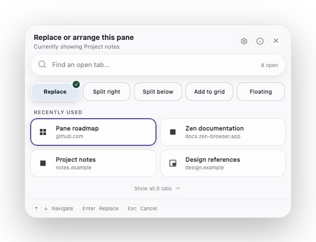
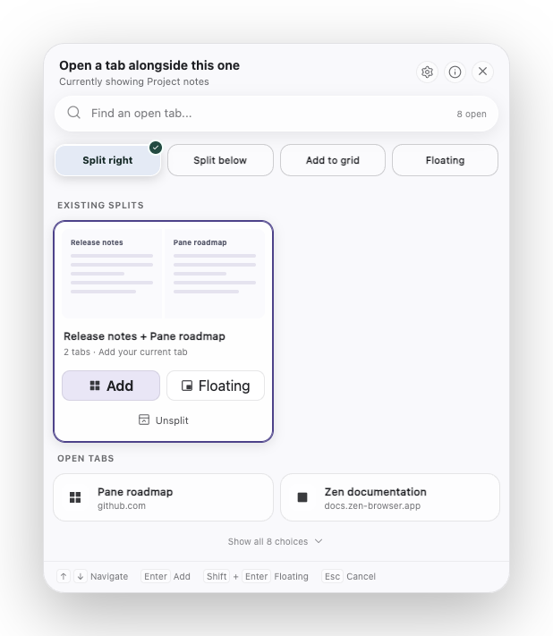
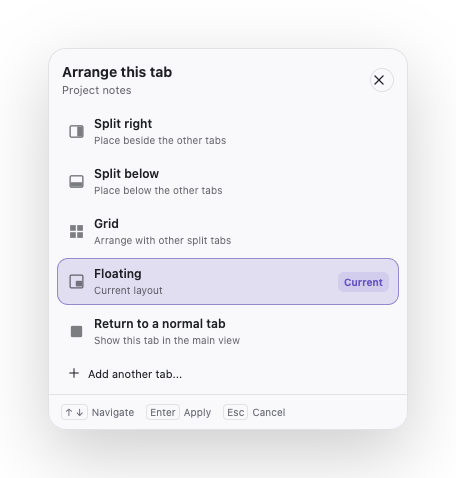
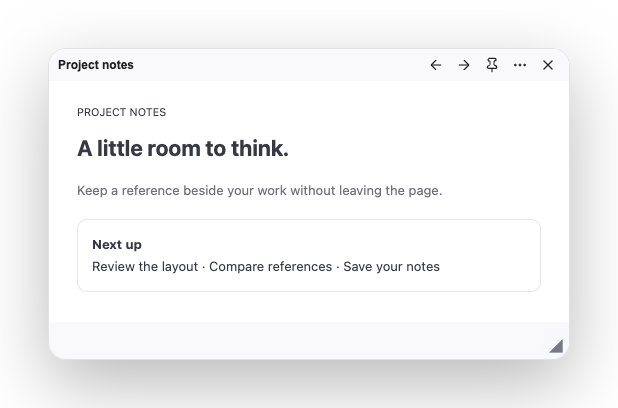

# Pane for Zen Browser

Split, float, arrange, and swap tabs in Zen Browser. Keep your pages open and your tabs where they belong.

A [Sine](https://github.com/CosmoCreeper/Sine) mod by [jasi (@001vamp)](https://github.com/001vamp).



Start with one tab or an existing split. Pick another open tab, choose a layout, and keep working. Replacing a pane keeps the split position and divider sizes.

## Install

You need Zen Browser and Sine **2.3 or newer**. Pane targets Zen **1.21.16b**. See [compatibility notes](COMPATIBILITY.md) for tested versions.

1. Open Zen **Settings → Sine Mods**.
2. Click the **gear beside the repository install field**, not the gear on Pane’s card.
3. Under **General**, enable **Install JavaScript from unofficial sources**. Some versions call it **Enable installing JS from unofficial sources**. Pane needs this because it is not in Sine’s verified store. Only enable it for mods you trust: these scripts have browser-level access.
4. Close that panel and paste this into the repository install field:

   ```text
   001vamp/zen-pane-manager
   ```

5. Install Pane, then fully quit and reopen Zen. If Sine shows **Restart to apply changes**, use that button.

## Use Pane

Press **Control+Option+R** on Mac or **Alt+Shift+P** on Windows and Linux. Choose what you want to do, then pick an open tab:

- **Replace** swaps the tab in the current split pane. The outgoing tab stays open by default.
- **Split right** or **Split below** puts the chosen tab beside or below it.
- **Add to grid** adds another tab to the split.
- **Floating** opens the tab in a movable, resizable panel inside Zen.

Search by title or website, or click **Show all** for the full list. Use the arrow keys to select a tab and **Enter** to apply. **Escape** clears the search, collapses the list, then closes the picker.

### Join or separate a split

From a solo tab, **Existing splits** shows the split groups in your workspace. Choose **Add** to join a group's grid, or **Floating** to float your current tab over it. **Enter** adds it; **Shift+Enter** floats it.

Choose **Unsplit** on a split card to separate the whole group. Every page stays open and returns to its original place in the sidebar.



### Pane toolbar

The toolbar appears briefly when you switch panes. Move your pointer to the **top center of the pane** to bring it back. It hides when you move away and stays visible while you use its controls with the keyboard.

Use it to open the picker, go back or forward, rearrange the pane, or remove it from the split. The **three-dot menu** lets you change layouts or add another tab. Press **Option+Shift+L** on Mac or **Alt+Shift+L** on Windows/Linux to open the selected split’s layout menu. The shortcut is customizable. Choose **Always visible** in settings if you prefer to keep toolbars open; floating headers also have a per-pane pin.



### Floating tabs

Drag the header to move a floating tab. Drag any edge or corner to resize it. The header hides automatically; hover over the top edge to reveal it, or use **Keep header visible** to leave it open.

You can float several tabs over the same split. Each has its own size, position, navigation controls, and header pin.

The close button returns the tab to the sidebar. It does not close the page. Use the layout menu to dock it back into a split or return it to the main view.



### Horizontal accordion (prototype)

In an existing split, open the layout menu and choose **Horizontal accordion**. One tab comes forward while narrow live edges of the other pages remain visible. Hover an edge for a small favicon and title hint, then click to switch tabs. Use **Option+Shift+Left/Right** on Mac or **Alt+Shift+Left/Right** on Windows or Linux to switch from the page. Navigation wraps at either end. When an edge has keyboard focus, plain **Left/Right**, **Home**, and **End** also work.

In Pane’s settings, use **Change shortcut** to record either layout navigation shortcut, or **Disable** to turn it off. Duplicate shortcuts within Pane are flagged and inactive until corrected. Accordion uses soft shadows to separate tabs. Optional edge lines are off by default; adjust their thickness, color, and opacity in the appearance controls.

Hover the top edge of the active page to reveal its title and controls. Use the arrows to switch tabs, the three-dot button to arrange them, or the grid button to **Restore tiled layout** with your previous divider sizes. Dock any floating tabs before entering accordion. Accordion is restored when Zen restores the split after a restart. Disabling Pane removes its presentation and restores tracked tabs to their original placement.

### Pinned tabs, folders, and Essentials

Pane uses the original tab for standard tabs, pinned tabs, folder tabs, and Essentials. This keeps the page's history, playback, forms, and scroll position intact.

While an Essential is split, its Essential slot becomes a shortcut to that same split tab. When any tab leaves the split, Pane returns it to its original workspace, section, folder, and sidebar position. If its old folder no longer exists, Pane returns it to the normal pinned or unpinned section instead.

The picker shows tabs and split destinations from the active workspace. When replacing a pane, it leaves out tabs already in another split.

## Settings

Click the **gear in the picker** for the complete settings page. Pane’s gear in **Settings → Sine Mods** exposes the same controls, with a button to open the complete page.

Change appearance, toolbar visibility, shortcuts, scrolling widths, and tab behavior. Appearance controls have live previews and precise values. Changes save immediately. **Reset this section** resets only that section.

For a shortcut, click **Change shortcut**, press your keys, and release. **Escape** cancels; **Use default** and **Disable** are available. A plain letter or number gets a warning before saving. Pane detects its own shortcut conflicts, but shortcuts reserved by Zen or your operating system may not reach it.

## If nothing happens

If the shortcut does nothing and the split toolbar has no Pane button:

1. Check the unofficial JavaScript permission in Sine’s general settings. You can also check `sine.allow-unsafe-js` in `about:config`; it should be `true`.
2. Toggle Pane off and back on.
3. Fully quit Zen and reopen it.

Still stuck? Press **Control+Option+D** on Mac or **Alt+Shift+D** on Windows and Linux to copy a diagnostic report. The picker’s **info button** copies the same report. Paste it into a [bug report](https://github.com/001vamp/zen-pane-manager/issues/new?template=bug_report.yml) and describe what you were doing.

Reports include versions and loading information, but no tab titles, URLs, searches, browsing history, or file paths. If the diagnostic shortcut also does nothing, include your Zen and Sine versions in the issue.

## Current limitations

Pane has been tested on **macOS and Windows**, including everyday use by the maintainer.

- Zen allows up to four tabs per split, including a floating tab.
- Float up to three tabs in a split, with at least one tab left in the background. Each floating tab has its own position, size, and header pin. Floating tabs stay inside their Zen window.
- Floating positions, sizes, and header pins are restored when Zen restores the split after a restart. Panels are fitted inside the current window. Docking a panel or disabling Pane clears its saved floating state.
- Pane uses Zen’s internal split API, which can change between releases.

See [COMPATIBILITY.md](COMPATIBILITY.md) for more detail.

## About

Pane runs locally, with no telemetry or accounts. Tab previews are captured in memory and are not saved or uploaded. Pane stores tab placement and layout details locally so it can restore special tabs and presentations after a restart. Sleeping tabs stay asleep until opened. See [Privacy](PRIVACY.md) and [Security](SECURITY.md).

Try Pane with your own tabs, layouts, and mods. If something breaks, try to reproduce it and [open an issue](https://github.com/001vamp/zen-pane-manager/issues/new?template=bug_report.yml) with the steps and a diagnostic report. Testing, debugging, and fixes are welcome.

See [Contributing](CONTRIBUTING.md), the [roadmap](ROADMAP.md), and the [changelog](CHANGELOG.md).

The images above use sample tabs on a white HTML sheet, with Pane’s [actual stylesheet](chrome.css) and icons. The [screenshot sheet](docs/pane-readme-showcase.html) is included in the repo.

Licensed under [MPL-2.0](LICENSE). Third-party notices are in [LICENSE-NOTES.md](LICENSE-NOTES.md). Pane is a community project, independent of Zen Browser and Sine.

### Experimental scrolling

In an existing split, open the layout menu and choose **Scrolling (experimental)**. Your active page stays full width. Hold **Option+Shift** on Mac or **Alt+Shift** on Windows/Linux to reveal the columns, then use the wheel or two-finger trackpad scrolling. Release to expand the centered tab. **Escape** cancels and returns to the starting tab. Opening the layout menu cancels the gesture without committing another selection.

While the columns are visible, drag a right edge to resize a tab. Double-click the edge or use its header reset button to restore the default width. You can change the modifier and default width in Pane settings. Individual width overrides survive changes to the default. **Reset all column widths** in the layout menu clears those overrides.

This is an early feature. Scrolling layouts and custom column widths are restored when Zen restores the split. Please report problems with your OS, Zen version, and steps to reproduce.
